# Trickster — Database Schema & ERD

**Companion document to:** Trickster PRD v1.0
**Scope:** Phase 1 MVP (per PRD Section 5)
**Database:** PostgreSQL (Supabase-hosted), accessed via Laravel Eloquent

---

## 1. Entity-Relationship Diagram (Mermaid)

Paste this block into [mermaid.live](https://mermaid.live) or any Mermaid-compatible renderer to view visually.

```mermaid
erDiagram
    USERS ||--o{ SMART_WEIGHT_PROFILES : creates
    TEAMS ||--o{ PLAYERS : rosters
    TEAMS ||--o{ MATCHES : "plays (team_a / team_b)"
    EVENTS ||--o{ MATCHES : hosts
    PATCHES ||--o{ MATCHES : "active during"
    PATCHES ||--o{ AGENT_PATCH_RATINGS : rates
    PATCHES ||--o{ AGENT_MAP_RATINGS : rates
    PATCHES ||--o{ AGENT_PICK_RATE_SNAPSHOTS : snapshots
    MATCHES ||--o{ MAPS : contains
    STAGE_LABEL_MAPPING ||--o{ MATCHES : normalizes
    MAPS ||--o{ PLAYER_MAP_STATS : records
    PLAYERS ||--o{ PLAYER_MAP_STATS : plays
    PLAYERS ||--o{ PLAYER_CRITERIA_SCORES : scored_on
    PLAYERS ||--o{ PLAYER_SMART_RESULTS : ranked_in
    SMART_CRITERIA ||--o{ PLAYER_CRITERIA_SCORES : defines
    SMART_CRITERIA ||--o{ SMART_WEIGHT_VALUES : weighted_as
    SMART_CRITERIA ||--o{ SMART_FILTER_CRITERIA : filterable_by
    SMART_WEIGHT_PROFILES ||--o{ SMART_WEIGHT_VALUES : contains
    SMART_WEIGHT_PROFILES ||--o{ PLAYER_SMART_RESULTS : produces
    SMART_WEIGHT_PROFILES ||--o{ SEARCH_QUERY_FILTERS : applies
    SCRAPE_JOBS_LOG ||--o{ SCRAPE_ALERTS : triggers
    AGENT_MAP_RATINGS ||--o| AGENT_MAP_RATINGS : superseded_by

    USERS {
        uuid id PK
        string email UK
        string password_hash
        enum role "user, admin, super_admin"
        timestamp created_at
    }
    TEAMS {
        uuid id PK
        string name
        enum region "NA, EMEA, APAC"
        string logo_url
        string vlr_team_id UK
    }
    PLAYERS {
        uuid id PK
        string name
        string ign
        string country
        uuid team_id FK
        enum current_role
        string vlr_player_id UK
        timestamp created_at
    }
    PATCHES {
        uuid id PK
        string version UK
        date release_date
        string patch_notes_url
    }
    EVENTS {
        uuid id PK
        string name
        enum tier "vct_regional, vct_international"
        enum region "NA, EMEA, APAC, international"
        string season
        date start_date
        date end_date
        string vlr_event_id UK
    }
    MATCHES {
        uuid id PK
        uuid event_id FK
        uuid team_a_id FK
        uuid team_b_id FK
        uuid patch_id FK
        uuid stage_label_id FK
        date match_date
        smallint best_of
        string raw_stage_label
        string vlr_match_id UK
    }
    MAPS {
        uuid id PK
        uuid match_id FK
        string map_name
        uuid winner_team_id FK
        smallint map_order
    }
    STAGE_LABEL_MAPPING {
        uuid id PK
        string raw_label UK
        enum normalized_stage "regular_season, playoffs, grand_final"
        decimal pressure_weight
    }
    PLAYER_MAP_STATS {
        uuid id PK
        uuid player_id FK
        uuid map_id FK
        enum role_at_time_of_match
        string agent_played
        decimal acs
        decimal kast
        decimal adr
        decimal kd
        int first_kills
        int first_deaths
        int clutch_wins
        decimal rating
    }
    AGENT_ROLE_MAP {
        string agent PK
        enum primary_role
        enum secondary_role
    }
    AGENT_PATCH_RATINGS {
        uuid id PK
        uuid patch_id FK
        string agent
        enum role
        enum tier "S, A, B, C, D"
        enum direction "buffed, nerfed, unchanged, reworked"
        text notes
    }
    AGENT_MAP_RATINGS {
        uuid id PK
        uuid patch_id FK
        string agent
        string map
        decimal score
        date effective_date
        string source_reference
        enum confidence_level "early_speculative, confirmed_by_tournament"
        uuid superseded_by_id FK
    }
    AGENT_PICK_RATE_SNAPSHOTS {
        uuid id PK
        uuid patch_id FK
        string agent
        string map
        enum region
        decimal pick_rate
        decimal win_rate
        date snapshot_date
        string source
    }
    SMART_CRITERIA {
        uuid id PK
        string name UK
        enum type "benefit, cost"
        text description
    }
    SMART_WEIGHT_PROFILES {
        uuid id PK
        uuid user_id FK
        string name
        boolean is_public
        timestamp created_at
    }
    SMART_WEIGHT_VALUES {
        uuid id PK
        uuid profile_id FK
        uuid criteria_id FK
        smallint rank_position "nullable = skipped"
        decimal computed_weight
    }
    SMART_FILTER_CRITERIA {
        uuid id PK
        uuid criteria_id FK
        enum filter_type "min_threshold, max_threshold, min_sample_size"
        decimal default_value
    }
    SEARCH_QUERY_FILTERS {
        uuid id PK
        uuid profile_id FK
        uuid criteria_id FK
        enum operator ">=, <=, =="
        decimal value
    }
    PLAYER_CRITERIA_SCORES {
        uuid id PK
        uuid player_id FK
        uuid criteria_id FK
        uuid patch_id FK "nullable, season-scoped"
        decimal raw_value
        decimal global_normalized_utility
        int sample_size
        timestamp calculated_at
    }
    PLAYER_SMART_RESULTS {
        uuid id PK
        uuid player_id FK
        uuid profile_id FK
        uuid patch_id FK
        enum mode "global, selection"
        decimal final_score
        int rank
        timestamp calculated_at
    }
    SCRAPE_JOBS_LOG {
        uuid id PK
        string source
        enum status "success, failed, partial"
        timestamp started_at
        timestamp finished_at
        text error_message
        int records_processed
    }
    SCRAPE_ALERTS {
        uuid id PK
        uuid job_id FK
        string alert_type
        text message
        boolean is_resolved
        timestamp created_at
    }
```

---

## 2. Table Reference (Grouped by Domain)

### 2.1 Identity & Access

**`users`**
| Column | Type | Notes |
|---|---|---|
| id | uuid PK | |
| name | string | |
| email | string, unique | |
| password_hash | string | managed by Laravel Breeze/Fortify |
| role | enum(`user`, `admin`, `super_admin`) | default `user` |
| created_at / updated_at | timestamp | |

- `admin`: curates `agent_patch_ratings`, `agent_map_ratings`, `stage_label_mapping`; monitors `scrape_alerts`.
- `super_admin`: all `admin` permissions + manages user accounts/roles.
🔵 Open Question (carried from PRD Section 10): confirm this split matches actual intent.

### 2.2 Core Esports Entities

**`teams`** — `id`, `name`, `region` (NA/EMEA/APAC), `logo_url`, `vlr_team_id` (unique, scrape anchor)

**`players`** — `id`, `name`, `ign`, `country`, `team_id` (FK, nullable — free agents), `current_role`, `vlr_player_id` (unique), `created_at`
- `current_role` is the player's *listed* role today — **not** used for historical per-match role calculations (see `player_map_stats.role_at_time_of_match`).

**`patches`** — `id`, `version` (unique, e.g. "9.08"), `release_date`, `patch_notes_url`

**`events`** — `id`, `name`, `tier` (`vct_regional` / `vct_international`), `region`, `season`, `start_date`, `end_date`, `vlr_event_id` (unique)
- Scope per PRD: VCT Regional + VCT International (Masters, Champions), regions NA/EMEA/APAC, season 2025 / VCT Kickoff 2026 onward.

**`matches`** — `id`, `event_id` FK, `team_a_id` FK, `team_b_id` FK, `patch_id` FK, `stage_label_id` FK (nullable until normalized), `match_date`, `best_of`, `raw_stage_label` (raw text as scraped, e.g. "Playoffs - Grand Final"), `vlr_match_id` (unique — idempotency key for scraper upserts)

**`maps`** — `id`, `match_id` FK, `map_name`, `winner_team_id` FK, `map_order`

**`stage_label_mapping`** — `id`, `raw_label` (unique, raw VLR.gg text), `normalized_stage` (`regular_season` / `playoffs` / `grand_final`), `pressure_weight` (optional multiplier for Tournament Pressure Score)
- Populated/maintained by admin since raw label formats vary across events (confirmed in discovery: "gunakan variasi").

### 2.3 Player Performance Data

**`player_map_stats`** — `id`, `player_id` FK, `map_id` FK, `role_at_time_of_match`, `agent_played`, `acs`, `kast`, `adr`, `kd`, `first_kills`, `first_deaths`, `clutch_wins`, `rating`
- Stored **per map** (source of truth). Per-match aggregates (for features that need match-level, not map-level, granularity) are computed on read/at scoring time from this table — not duplicated into a separate table, to avoid redundant writes.
- `role_at_time_of_match` is captured at scrape/insert time, independent of the player's current listed role — required for correct role-scoped Consistency Index / SMART criteria per discovery Section 2.

### 2.4 Patch & Meta Curation (Manual Input)

**`agent_role_map`** — `agent` (PK), `primary_role`, `secondary_role` (nullable, for flex agents)

**`agent_patch_ratings`** — `id`, `patch_id` FK, `agent`, `role`, `tier` (S/A/B/C/D), `direction` (`buffed`/`nerfed`/`unchanged`/`reworked`), `notes`
- Feeds **Patch Impact Analysis**.

**`agent_map_ratings`** — `id`, `patch_id` FK, `agent`, `map`, `score` (1–10), `effective_date`, `source_reference`, `confidence_level` (`early_speculative` / `confirmed_by_tournament`), `superseded_by_id` (self-referencing FK, nullable)
- Feeds **Meta Adaptability Index** (both Meta Conformity and Meta Innovation).
- `effective_date` may post-date `patch_id.release_date` — meta is often confirmed by the pro scene weeks into a patch (confirmed in discovery: "mereferensikan setelah komunitas menemukan strategi optimal").
- Never overwritten on revision — old rows persist, linked via `superseded_by_id`, preserving the evolution of meta understanding within a single patch.

**`agent_pick_rate_snapshots`** — `id`, `patch_id` FK, `agent`, `map`, `region` (nullable), `pick_rate`, `win_rate`, `snapshot_date`, `source` (e.g. "vlr.gg scrape")
- Scraped, not manually curated. Used to (a) power **Meta Innovation Score** (low pick-rate + high relative performance), and (b) cross-validate admin-curated `agent_map_ratings` against real adoption trends.

### 2.5 SMART Decision Engine

**`smart_criteria`** — `id`, `name` (unique — e.g. "Consistency Index", "ACS", "Meta Conformity"), `type` (`benefit` / `cost`), `description`

**`smart_weight_profiles`** — `id`, `user_id` FK, `name`, `is_public` (boolean, default `false` — reserved for a possible future sharing feature, not built in Phase 1), `created_at`

**`smart_weight_values`** — `id`, `profile_id` FK, `criteria_id` FK, `rank_position` (nullable = user skipped this criterion), `computed_weight` (derived via Rank Sum Weighting)
- `rank_position` is stored as the source of truth — `computed_weight` can be recalculated in bulk if the weighting method ever changes (e.g. to Rank Order Centroid) without requiring users to re-rank.

**`smart_filter_criteria`** — `id`, `criteria_id` FK, `filter_type` (`min_threshold` / `max_threshold` / `min_sample_size`), `default_value`
- System-level defaults for hard filters (e.g. the 20-match minimum sample size).

**`search_query_filters`** — `id`, `profile_id` FK, `criteria_id` FK, `operator` (`>=` / `<=` / `==`), `value`
- Per-search custom hard filters set by the user, layered on top of `smart_filter_criteria` system defaults.

### 2.6 Computed / Cached Results

**`player_criteria_scores`** — `id`, `player_id` FK, `criteria_id` FK, `patch_id` FK (nullable — some criteria are season-scoped, not patch-scoped), `raw_value`, `global_normalized_utility`, `sample_size`, `calculated_at`
- Recalculated on: new match data ingested, patch/meta ratings updated, or scheduled recompute job.
- `sample_size` enables the 20-match minimum-sample gate at read time.

**`player_smart_results`** — `id`, `player_id` FK, `profile_id` FK, `patch_id` FK, `mode` (`global` / `selection`), `final_score`, `rank`, `calculated_at`
- `mode = global` → Global Rating (global min/max normalization; used for leaderboards/dashboards/history).
- `mode = selection` → Selection Score (candidate-pool min/max normalization; computed on-demand per search, not cached long-term — see PRD discovery on Selection Score volatility).

### 2.7 Scraper Monitoring

**`scrape_jobs_log`** — `id`, `source` (e.g. "vlr.gg/matches"), `status` (`success`/`failed`/`partial`), `started_at`, `finished_at`, `error_message`, `records_processed`

**`scrape_alerts`** — `id`, `job_id` FK, `alert_type`, `message`, `is_resolved`, `created_at`
- Surfaced in the Admin Curation Panel per PRD US-6. Manually monitored by the developer (no auto-remediation in Phase 1).

---

## 3. Key Design Decisions (Traceable to Discovery)

| Decision | Rationale |
|---|---|
| Stats stored **per map**, not duplicated per match | Match-level aggregates are computed on read from `player_map_stats`; avoids write duplication and keeps a single source of truth. |
| `role_at_time_of_match` on every stat row | Prevents historical role changes from polluting role-specific criteria (e.g. Consistency Index for "Initiator" should only use matches actually played as Initiator). |
| `agent_map_ratings` versioned via `effective_date` + `superseded_by_id`, never overwritten | Meta consensus often solidifies weeks after a patch drops; history must be preserved, not lost on revision. |
| `agent_pick_rate_snapshots` kept separate from manual `agent_map_ratings` | Pick rate is an *observed* signal (from scraping); rating tier is a *curated* signal (from admin). Keeping them separate enables cross-validation (Meta Innovation Score) instead of conflating the two. |
| Global Rating vs. Selection Score computed with different normalization scope, only `global` mode cached | Selection Score is inherently query-dependent (candidate-pool relative) and cheap to compute on a small pool (<20 candidates typically) — caching it long-term would be both stale-prone and unnecessary. |
| `smart_weight_values.rank_position` stored alongside `computed_weight` | Preserves the ability to switch weighting formulas (Rank Sum → Rank Order Centroid) later without forcing users to redo their ranking input. |
| Hard filters (`smart_filter_criteria`, `search_query_filters`) modeled separately from `smart_criteria`/weights | SMART is compensatory by design; hard filters must run as a distinct, non-compensatory pre-step (per PRD Section 5, Hard Filter Engine). |
| `stage_label_mapping` as its own lookup table, not an enum on `matches` directly | VLR.gg's raw stage text varies across events/organizers; normalization needs to be a maintainable, admin-editable table, not a fixed enum. |

---

## 4. Notes for Implementation

- All primary keys use `uuid` for consistency across services (scraper writes, Laravel API, potential future integrations) — adjust to auto-increment integers if simplicity is preferred for a solo-developer MVP; either works at this scale (~180 players).
- Idempotent upserts should key on the external identifiers scraped from VLR.gg (`vlr_match_id`, `vlr_player_id`, `vlr_team_id`, `vlr_event_id`) to avoid duplicate inserts on repeated hourly scrapes (per PRD Section 9 dependency notes).
- `player_criteria_scores` and `player_smart_results` are **cache tables** — they should never be treated as the source of truth; they can always be regenerated from `player_map_stats` + curation tables + weight profiles.